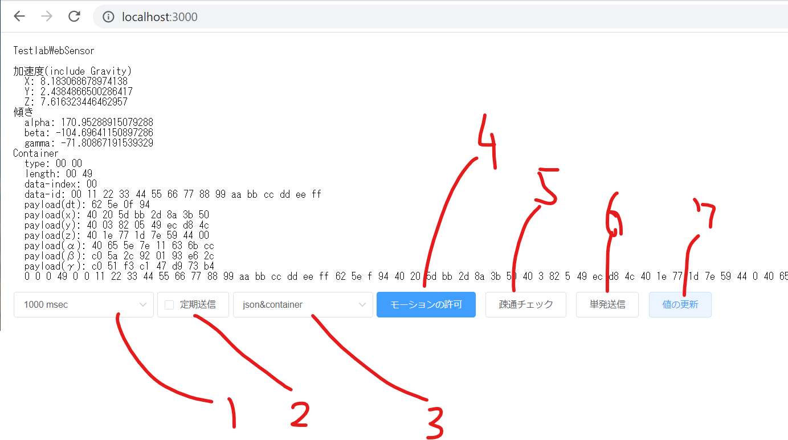

# container-websensor
container-websensor

```
[Nuxt Vue]
 | XHR(json/container)
[Nuxt Middleware(express)/Node.js/Server]
 | kafka(json/container)
[kafka broker]
```

## prepare
スマホの加速度やジャイロのセンサ情報を参照するには `https://` でのアクセスが必須になります

1. ngrok account
開発時向け
go to https://ngrok.com/
create account
get token
echo NGROK_AUTHTOKEN={your token} > .env

## Build Setup

```bash
# install dependencies
$ yarn install

# serve with hot reload at localhost:3000
$ yarn dev

# build for production and launch server
$ yarn build
$ yarn start
httpsでアクセスするためにはngrok等で対応する
$ ngrok http 3000
```


# 使い方
## 全体の動き
nuxtで作ったWebアプリを読み込む。
SPAからxhrでjson/containerをnuxt/api(=express/node.js)へ送る
kafkaへ送付する。


図1.シーケンス図
```plantuml
group Init
	Browser -> Nuxt: Request
	Nuxt->Browser: Document
end
group send data [recursive post/post]
	Browser->Browser: Motion
	Browser->NuxtApi: xhr
	NuxtApi->KafkaCluster: kafka
end
```

## 画面と使い方


1. 定期的にxhrを送信するときの設定値
2. 有効時に定期的に1.で設定した頻度でデータを送信する。
3. 送るデータ(json/container/json&container) json&containerはxhrをjsonとcontainerで独立して発行します
4. (📱限定) `https://` でアクセスしている際に加速度の情報
5. 疎通チェック、 `Browser` と `NuxtAPI` 間が通信できることを確認します
6. 現在の加速度や傾き情報を1回だけ送信します
7. 現在の加速度や傾き情報を乱数を元に適当に更新します。

## 本アプリを利用する
リアルタイムのセンサー値の送信のため 1と2の機能で定期的に値を更新している状態で、センサー値が送信されることがゴールになります。
